### Hi, I'm Tudor



Swift for a decade, C++ and Python when the job calls for it, and lately a lot of time spent getting language models to run on a phone instead of a server. iOS tech lead by day, indie developer by night, based in Luzern.

Most of my code is private because it ships as [apps](https://tudorturcanu.ch/apps/). This page is for the parts worth talking about with other developers.

#### Open source

- [**SkillHub**](https://github.com/tudorturcanu/SkillHub): SkillKit, a native macOS app (Swift 6, SwiftUI) that indexes the skills, rules, and prompts scattered across Claude Code, Codex, Cursor, Windsurf, and friends. Structured search (`review -draft is:rule tool:claude`), smart collections, an editor with live preview.
- [**Portly**](https://github.com/tudorturcanu/Portly): a menu bar app that lists every listening port with its process, PID, and live connections. Restarts servers and Docker containers, probes HTTP latency, and ends `EADDRINUSE` without an `lsof` one-liner.
- [**iphone-duo-skill**](https://github.com/tudorturcanu/iphone-duo-skill): an agent skill that teaches coding assistants the iPhone Duo APIs (reserved regions, arrangement views, side bars) and how to audit a codebase for layouts that break at the hinge.

```bash
npx skills add tudorturcanu/iphone-duo-skill -g
```

#### Problems I've been chewing on

- **Local inference on iOS.** MLX Swift and Apple's Foundation Models for chat, vision, and document Q&A; `whisper.cpp` for transcription; translation models sized to the device's physical memory. Everything stays on the device.
- **Streaming tokens into SwiftUI.** `AsyncSequence` fits until cancellation, actor isolation, and update frequency show up.
- **Parsing file containers by hand.** Walking JPEG segments, PNG chunks, ISOBMFF boxes, and PDF objects to rewrite metadata while copying every pixel byte for byte.
- **Sensors as input.** ARKit with `.gravityAndHeading` to pin summit names onto a live camera feed, RoomPlan and RealityKit for true-to-scale furniture, `CMHeadphoneMotionManager` to read head posture from AirPods.
- **Real-time audio.** A custom DSP synthesis engine that generates the soundscapes for a focus app on the fly.
- **Wrapping native engines in Mac apps.** A bundled `harper-ls` behind an `NSTextView` for offline grammar checking; readers for Realm, SQLite, SQLCipher, Core Data, and SwiftData stores.
- **Large codebases.** Features split vertically, logic horizontally, with the compiler enforcing the boundary.

#### Writing

- [What Whole-Module Optimization Actually Deletes](https://tudorturcanu.ch/blog/wmo-what-gets-deleted/)
- [Every Compiler Error Is a Bug That Didn't Ship](https://tudorturcanu.ch/blog/swift-guardrails-ai/)
- [Streaming LLM Responses with Swift Concurrency](https://tudorturcanu.ch/blog/streaming-llm-swift-concurrency/)
- [Scaling an iOS Codebase: Features Vertical, Logic Horizontal](https://tudorturcanu.ch/blog/features-vertical-logic-horizontal/)
- [Migrating to Swift Testing Without a Heroic Weekend](https://tudorturcanu.ch/blog/migrating-to-swift-testing/)

#### Archaeology

My MSc was in information security: a verifiable e-voting system built on mix networks, ElGamal, and zero-knowledge proofs. That's why the pairing-based crypto and group signature repos from 2016 are still sitting here.

#### Elsewhere

[tudorturcanu.ch](https://tudorturcanu.ch/) · [Blog](https://tudorturcanu.ch/blog/) · [RSS](https://tudorturcanu.ch/rss.xml) · [LinkedIn](https://linkedin.com/in/tudorturcanu)
